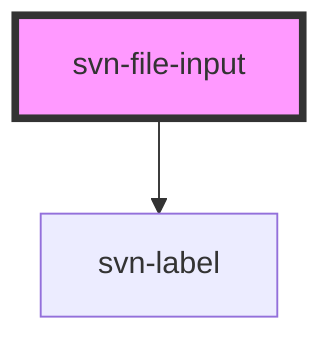

# svn-file-input

<!-- Auto Generated Below -->

## Properties

| Property            | Attribute   | Description                                 | Type      | Default     |
| ------------------- | ----------- | ------------------------------------------- | --------- | ----------- |
| `elId` _(required)_ | `el-id`     | the id of the component element             | `string`  | `undefined` |
| `fileType`          | `file-type` | the type of file that can be uploaded       | `string`  | `undefined` |
| `lblName`           | `lbl-name`  | the name for the label                      | `string`  | `undefined` |
| `multiple`          | `multiple`  | set to true to turn on multiple file select | `boolean` | `false`     |

## Dependencies

### Depends on

- [svn-label](../svn-label)

### Graph

----------------------------------------------

*Built with [StencilJS](https://stenciljs.com/)*
